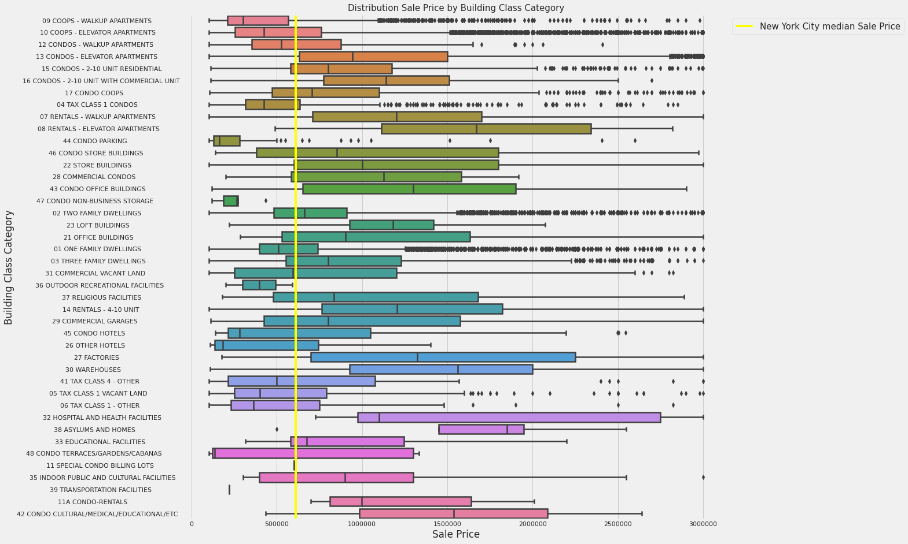
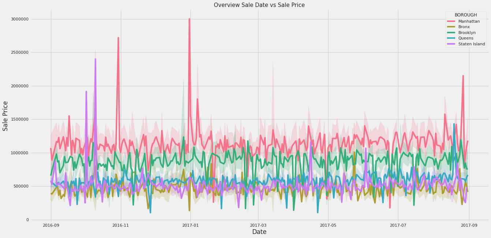
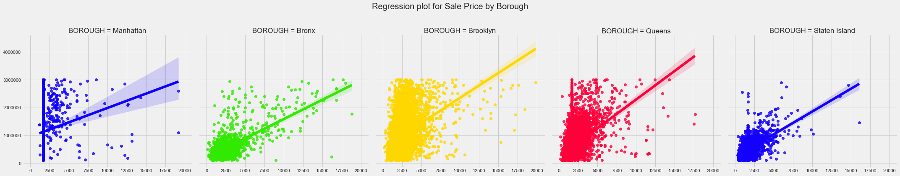

# New York City Property Sales Predictor (PSP)
For this personal project, I built a machine learning model in Python that could predict prices for properties in New York City. The reason why I did this project is that I'm very interested in real estate and wanted to know more about this domain and learn more about machine learning. This project is divided into 3 sections: [EDA](https://github.com/MLP99/NYC-PSP/blob/main/files/NYC_PSP_EDA.ipynb), [data preparation](https://github.com/MLP99/NYC-PSP/blob/main/files/NYC_PSP_PREPARATION.ipynb) and [model building](https://github.com/MLP99/NYC-PSP/blob/main/files/NYC_PSP_MODELLING.ipynb). I achieved the following things:

* Completed an Exploratory Data Analysis on the 80,000 properties in the dataset
* Built a machine learning model that could predict property prices in New York City
* Achieved a decrease of the Mean Absolute Error (MAE) from the properties in the validation data by 48% (~ $92.400,00) by only using Feature Engineering

## Conclusion
After doing this project I learned the following. Although I didn't deploy this model into production, I found this project a great exercise to learn more about data analysis, data preparation and model building. Due to the EDA, I learned more about this domain and what kind of data I was dealing with such as the different properties that exist in NYC and what the price difference was between the boroughs. From data preparation, I learned more about how I'm preprocessing my data like merging different datasets & how to remove outliers. Removing outliers made my brain work to get the data in a better format. From model building, I learned more about feature engineering and what kind of impact that could have on your model performance.

My next step for this project is to use hyperparameter tuning to improve my model's performance and use gradient boosters for example XGBoost that also could help in the process of achieving better results. After building a great model I would like to deploy it and use it in a web application where a user can use it to predict property prices.

## Data 
Data I used in this project:

* New York City property sales dataset: https://www.kaggle.com/new-york-city/nyc-property-sales
* New York City census dataset: https://www.kaggle.com/muonneutrino/new-york-city-census-data
## EDA
In this section, I would like to highlight a few visualizations that I made in my EDA with the Seaborn library for Python.

